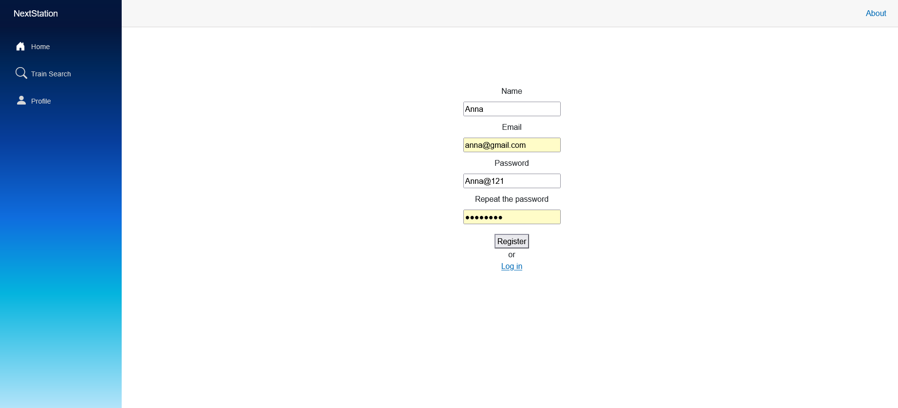
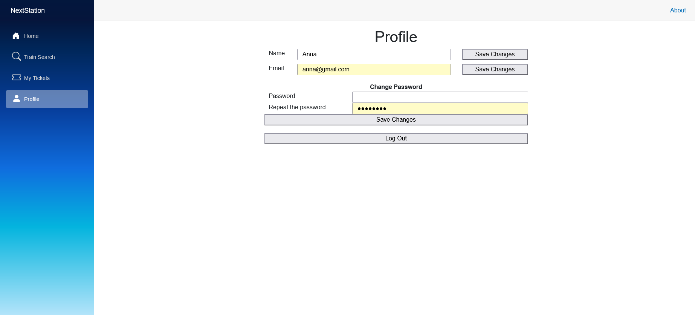
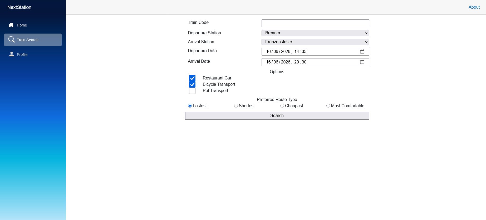
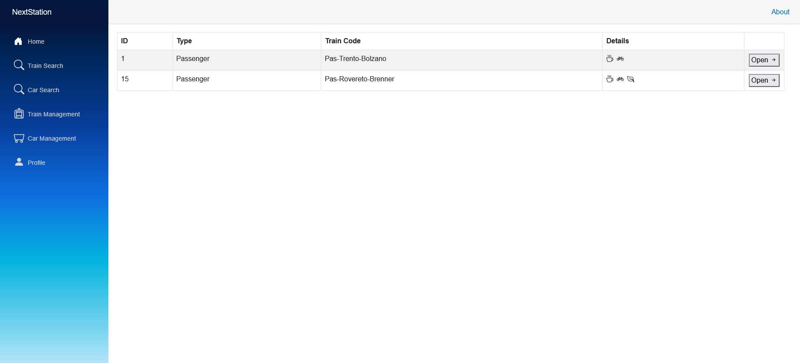
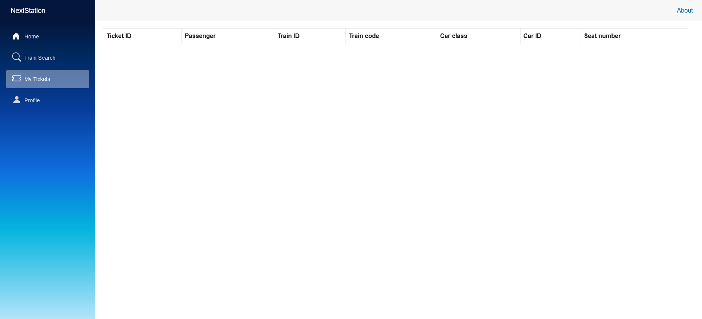
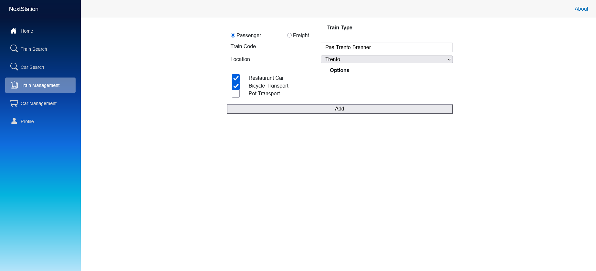
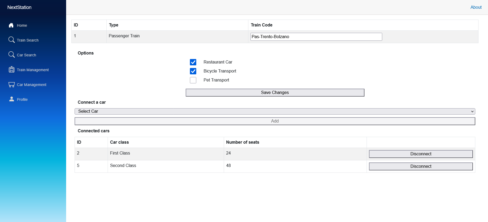
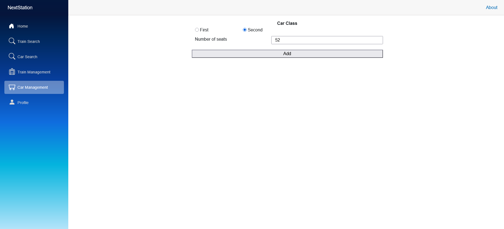
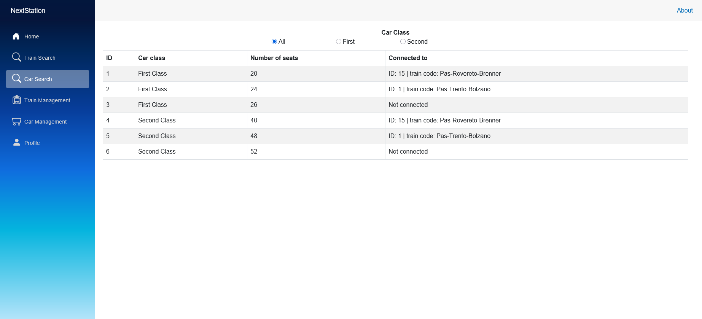

# NextStation

The NextStation is a web application that brings together the entire process of the journey under one roof. This includes ticket search and purchase, real-time tracking of the journey depending on the position information provided by the train operators, and electronic validation of the ticket on board the train. There are five human actors in the system: passengers, train operators, conductors, network managers and station managers.

|Role|Permissions|
|||
|Passenger|Search trains; book tickets; view booked tickets; checks real-time position and delay of the train|
|Network Manager|add/modify/remove trains, their cars, routes, and schedules; create operator accounts; modify the permission level of any staff’s users stored in the system|
|Station Manager|update timetables and locations of the trains|
|Train operator|check real-time visibility of other trains’ positions and possible delays to coordinate safe operations|
|Conductor|check and validate passenger tickets|

## Current functionality

The web application currently supports:

- <b>Registration</b>. Restrictions for registration are as follows:
	- The email must be unique
	- The password must be at least 8 characters long and contain at least one uppercase letter, one lowercase letter, one number, and one special character
	- The entered password must match the confirmed password

	

- <b>Login</b>. Restrictions for login are as follows:
	- The email address must be registered in the system
	- The password must match the one associated with the email address

	

- <b>Profile Management</b> (passenger's view). Restrictions for profile management are as follows:
	- The email must be unique
	- The password must be at least 8 characters long and contain at least one uppercase letter, one lowercase letter, one number, and one special character
	- The entered password must match the confirmed password

	

- <b>Train Search</b>, search for trains (unregistered user's view). Restrinctions for train search are as follows:
	- The departure and arrival stations must be different
	- The departure and arrival dates must be in the future

	

- <b>Train Search</b>, received trains (unregistered user's view)

	

- <b>Booked Tickets view</b>, no tickets were booked (available only to the passenger)

	

- <b>Train Management</b>, adding trains (available only to the network manager). Restrinctions for train management are as follows:
	- The location must be selected from the list of stations

	

- <b>Train Management</b>, trains modification (available only to the network manager)

	

- <b>Car Management</b>, adding cars (available only to the network manager). Restrinctions for car management are as follows:
	- The number of seats must be a positive integer
	
	

- <b>Car Search</b> (available only to the network manager)
	
	
